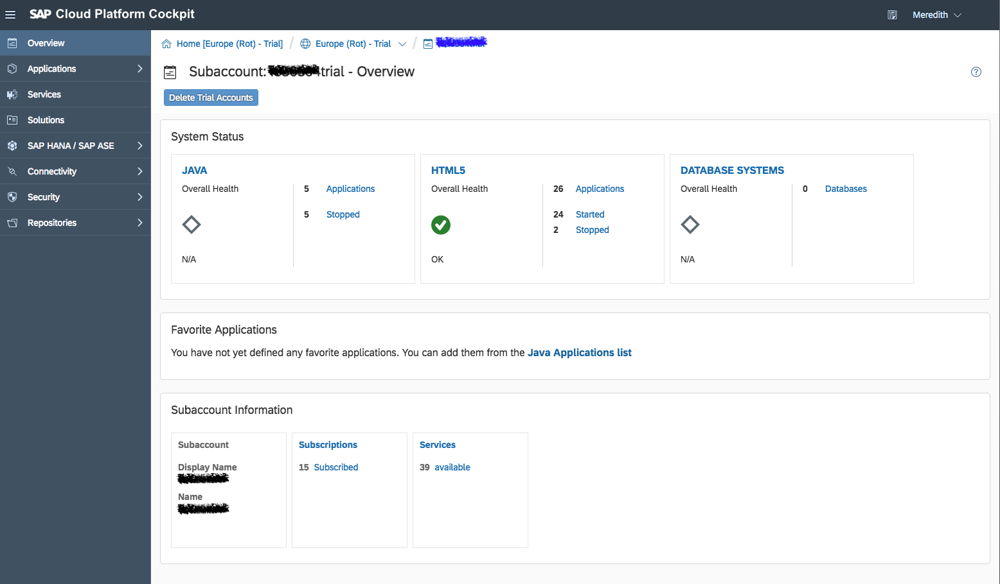
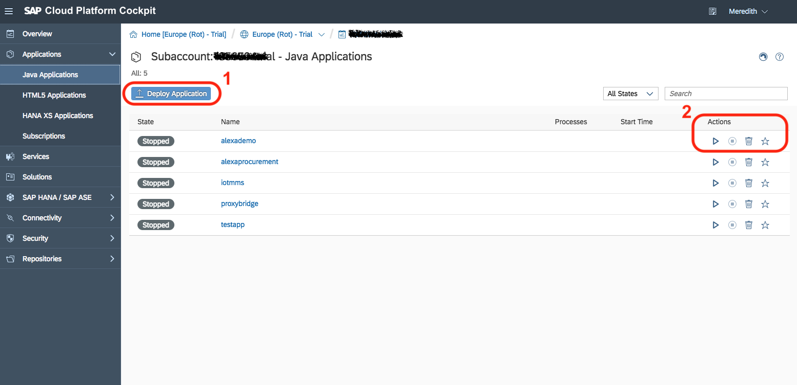
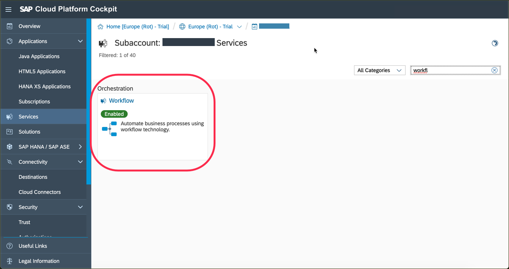
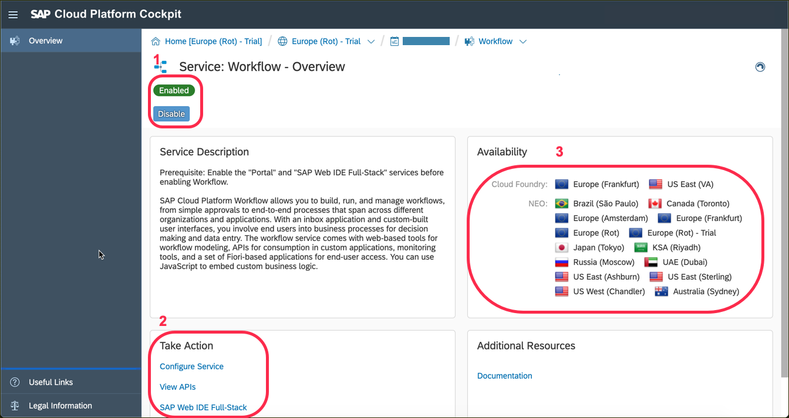
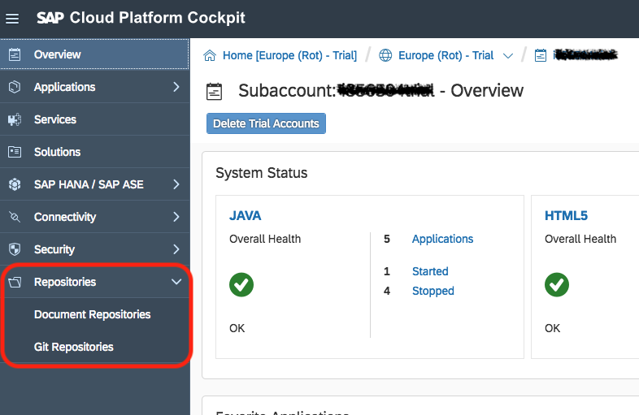
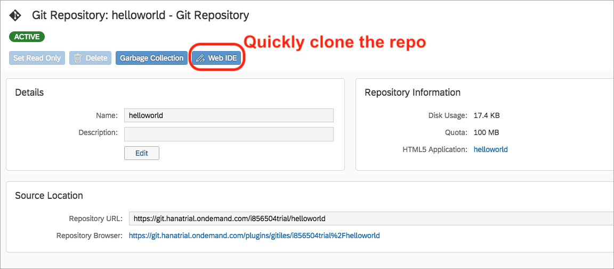
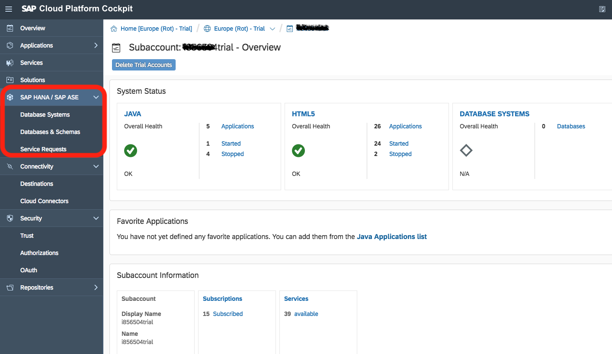

### 您将了解  
  - 服务在 SAP Cloud Platform 中的位置
  - 如何在主控室中导航
  - 如何在 SAP Cloud Platform 架构之间移动

在进行云开发时，SAP Cloud Platform 主控室是您的主要指挥中心。了解如何使用提供的所有控件对于充分利用 SAP Cloud Platform 非常重要。

---

[ACCORDION-BEGIN [Step 1: ](欢迎使用您的主控室)]

欢迎使用您的 SAP Cloud Platform 主控室和试用账户。在以下步骤中，您将探索左侧导航窗格上的许多选项、“系统状态”部分的详细信息以及如何使用导航痕迹四处移动。

在进行后续步骤之前，请确保您位于此**主控室概览**页面。

[DONE]
[ACCORDION-END]

[ACCORDION-BEGIN [Step 2: ](了解系统状态)]

“概览”页面上的“系统状态”部分使您可以快速浏览应用程序的运行状况。您可以在 SAP Cloud Platform 上托管 Java 应用程序、HTML 应用程序和数据库系统。“总体运行状况”可让您了解已启动的任何应用程序是否面临停机问题。您还可以看到有关拥有的应用程序数以及已启动或停止的应用程序数的概览。

要获得有关应用程序的更多详细信息，请单击左侧导航窗格上的“应用程序”选项卡。然后单击 Java 应用程序。

[DONE]
[ACCORDION-END]

[ACCORDION-BEGIN [Step 3: ](探索应用程序)]

在 Java 应用程序页面中，您可以执行初始操作。如果您已经具有正在开发的 Java 应用程序，则可以在此处**将应用程序部署到 SAP Cloud Platform**（请参阅下图中的 #1）。对于 HTML5 应用程序和 XSA 系统，您同样可以使用此选项。

对于已经部署到 SAP Cloud Platform 的应用程序，您可以在此处对应用程序执行标准操作（请参阅下图中的 #2）。通过单击_播放样式图标_，您可以**启动应用程序**（如果尚未运行）。或者，您可以通过单击_带圆圈的正方形图标_来**停止正在运行的应用程序**。使用_垃圾桶图标_，您可以**删除应用程序**。单击_星型图标_将**收藏应用程序**。

[DONE]
[ACCORDION-END]

[ACCORDION-BEGIN [Step 4: ](深入了解应用程序概览)]

**您可以通过单击应用程序名称来探索有关该应用程序的详细信息**。如果您是 SAP Cloud Platform 新用户，可能现在没有可用于探索的应用程序！

单击名称后，将转到“应用程序概览”页面。此页面是您单击的单个应用程序的高级视图。

在此，您将找到有关您的应用程序的特定信息。您可以_监控资源消耗_、_更新应用程序版本_、查找_应用程序 URL_等。它是应用程序的集中式仪表盘。

您可能已经注意到，出现了**新的左侧菜单选项**。在此，您可以进入**监控**选项卡下的应用程序_日志_，在**配置**选项卡下配置_数据源_，并在**安全性**选项卡下更新_应用程序权限_。

让我们来了解一下安全性功能的工作原理。

[DONE]
[ACCORDION-END]

[ACCORDION-BEGIN [Step 5: ](更新应用程序安全性)]

继续单击**安全性**，然后单击**角色**以转到应用程序的“角色”页面。

应用程序将具有不同的角色。或许您团队中的某些人员需要对于“应用程序概览”具备管理员访问权限，而其他人员可能只是开发人员，仅需要访问代码。通过使用“安全性”设置下的“角色”，可以定义每个用户或一组用户需要的访问权限。

要_将个人分配到角色_，请首先在“角色”列表中**选择一个角色**。然后在“个人用户”旁**单击“分配”按钮**。

在弹出框中，**输入用户标识**（例如：您的 P 编号），然后单击**分配**。

现在，该用户在下次刷新其会话时即可访问。

这对于生产账户非常有用，但您可能无法在试用账户中使用。但是，如果您从不需要与同事或队友共享应用程序，请记住这一点！

[DONE]
[ACCORDION-END]

[ACCORDION-BEGIN [Step 6: ](使用导航痕迹导航)]

现在您可能会有疑问，左侧菜单更改后，如何返回主控室。不必担心！屏幕顶部的便捷_导航痕迹_有助于**导航**。

导航痕迹列表中的第一个项目 ( **#1** ) 是**试用主页**。这样一来，您便知道自己已经位于试用账户中。如果单击此链接，将返回到试用主页，在此_您可以选择 Neo 账户或 Cloud Foundry 账户_。当您需要进行设置时，这对于在两者之间切换非常方便。

第二个项目 ( **#2** ) 是**区域**。这是 SAP Cloud Platform 数据中心所在的位置。通过单击该项目，您可以在区域之间快速切换。_移至先前设置的 Cloud Foundry 架构，或移至公司生产账户_也很方便。

第三个项目 ( **#3** ) 是您的“子账户”。这将带您返回_主控室概览页面_。如果您陷入繁杂的路径中，返回此空间是个不错的选择！

在这种情况下，第四个项目 ( **#4** ) 是 **Java 应用程序**。导航痕迹列表将反映您单击的左侧菜单项。通过单击应用程序名称旁边的箭头，您将看到_其他 Java 应用程序列表，可以在它们之间快速导航_。

继续操作并导航回到您的 SAP Cloud Platform 主控室。

[DONE]
[ACCORDION-END]

[ACCORDION-BEGIN [Step 7: ](有哪些服务？)]

SAP Cloud Platform 提供了丰富的服务供您使用。后续教程将深入探讨其中的一些服务，但是有时仔细研究现有的服务也很有趣。

要查看 SAP Cloud Platform 提供服务的列表，请单击左侧菜单中的**服务**选项卡。

在**服务页面**上，您可以通过**单击磁贴**来探索服务。选择任意服务，然后单击该服务。

在“服务概览”页面上，您会找到一些标准内容。

第一部分 ( **#1** ) 是_服务状态_。通常为已启用或已禁用。**要更改状态，只需单击按钮**。如果您不在生产账户中使用某个服务，将其禁用会很有帮助，因为将该服务保持“已启用”状态可能会影响开票。

第二部分 ( **#2** ) 是您可以对服务执行的_操作_。启用服务后，您将具有**转到服务**选项，用于启动服务。如果您需要服务的其他目标和数据源或更新权限，也可以配置服务。一些服务可能会有更多操作，因为它们可能具有多个门户来利用所有功能。

需要注意的最后一个部分 ( **#3** ) 是_可用性。如果您想知道为什么在公司的生产账户中看不到服务，这可能与该地区的可用性有关。并非在所有地区和所有架构中都提供所有服务。

[DONE]
[ACCORDION-END]

[ACCORDION-BEGIN [Step 8: ](存储您的代码)]

返回您的 SAP Cloud Platform 主控室。

另一个需要注意的便捷开发人员工具是**资源库**。资源库有助于代码维护和迁移。如果单击_左侧菜单_中的**资源库**选项卡，则会找到几种可以存储在 SAP Cloud Platform 上的不同类型的资源库。

**单击 Git 资源库**导航到资源库页面。如果您之前使用过 GitHub 或其他代码管理工具，则会发现使用体验类似。

在资源库页面中，您将找到所有资源库的列表、创建新资源库的可用性以及该资源库的使用数据。

如果您拥有资源库，请**单击资源库名称**。

从其他环境克隆新资源库时，您会在 Git 资源库概览中找到特定资源库的手动工具。您可以将应用程序快速克隆到 SAP Web IDE（SAP 的基于云的开发环境）中。在后续教程中，您将了解有关 SAP Web IDE 的详细信息。

此外，您将在此处找到有关磁盘使用情况、资源库 URL 以及已部署应用程序（如果适用）的信息。

不要忘记使用该工具，因为该工具已跨许多 SAP Cloud Platform 服务与其他 SAP 工具集成！

[DONE]
[ACCORDION-END]

[ACCORDION-BEGIN [Step 9: ](数据库系统的快速概览)]

返回您的 SAP Cloud Platform 主控室，查看左侧菜单的 **SAP HANA/SAP ASE** 部分。如果单击 SAP HANA/SAP ASE 选项卡，您会发现 3 种数据管理类型：数据库系统、数据库和模式以及服务请求。

[DONE]
[ACCORDION-END]

[ACCORDION-BEGIN [Step 10: ](连接的快速概览)]

返回您的 SAP Cloud Platform 主控室，查看左侧菜单的**连接**部分。如果单击“连接”选项卡，您会发现 2 种连接类型：目标和云连接器。

**目标**将帮助您_连接到基于云的外部系统_（无论这些系统是否是 SAP 系统），并针对 SAP Cloud Platform 中的数据使用该系统。“目标”可处理大多数浏览器上有关验证、权限和同源策略的繁重工作。通过处理跨源验证，还可对在应用程序中使用此数据点的源进行验证。您会发现这在进行 _API 调用_时非常有用。

**云连接器**将帮助您_连接到企业预置 SAP 系统_。当您想要从企业预置 SAP 软件或产品中获取数据并将其用于_云中的扩展构建_时，您会发现使用云连接器很方便。

[DONE]
[ACCORDION-END]

[ACCORDION-BEGIN [Step 11: ](安全性的快速概览)]

返回您的 SAP Cloud Platform 主控室，查看左侧菜单的**安全性**部分。单击“安全性”选项卡时，将发现可以管理的 3 项内容：信任、权限和 OAuth。

[DONE]
[ACCORDION-END]